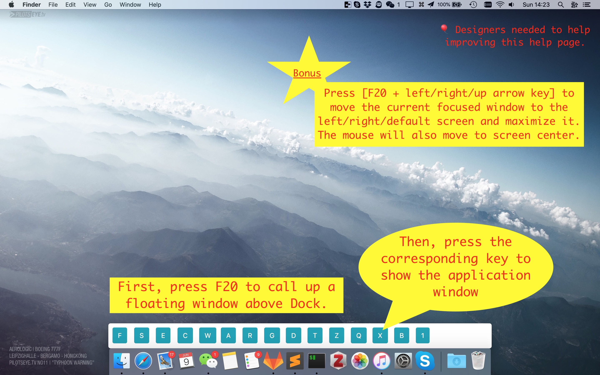

# dock-switch
Quickly switch among applications in the macOS Dock with one global hotkey.

## Screenshot


## How It Works
- Press `F20` to open the floating launcher UI.
- In the current default config, `F20` then `Tab` launches or focuses `ChatGPT`.
- Press the shown key for an app to focus it.
- Press an arrow key to tile the frontmost window on its current display:
  - `←` left half
  - `→` right half
  - `↑` external display
  - `↓` internal display, or maximize on the internal display when already there
- Press `\` to enter macOS native fullscreen (same as the green window button).
- The UI closes automatically after a selection.

## Browser Fixed Placement
This project supports per-app window placement through `src/config.json`.

Example:

```json
{
  "name": "Safari",
  "key": "S",
  "screen": "3",
  "placement": "external_right_half"
}
```

```json
{
  "name": "Google Chrome",
  "key": "G",
  "screen": "4",
  "placement": "internal_fill"
}
```

When triggered from dock-switch, Safari lands on the right half of the external display.
The `X` web app also lands on the right half of the external display.
Google Chrome is maximized on the internal display work area.
If no external display is available, `external_right_half` falls back to the internal display work area.

## Remember Last Window Size/Position
By default, dock-switch remembers the last known window bounds (x/y/width/height) for each app and restores them when that app is reopened from dock-switch.

- Window state is kept in memory for the current app session (no disk persistence).
- This includes maximized-like window sizes because the actual bounds are restored.
- Apps with explicit `placement` (for example `external_right_half` or `internal_fill`) keep that placement behavior.

To disable restore for a specific app, add:

```json
{
  "name": "Terminal",
  "key": "T",
  "screen": "4",
  "remember_window_state": false
}
```

## Installation
- Download a release from [GitHub Releases](https://github.com/longbiaochen/dock-switch/releases).

## Build From Source
1. Clone this repository.
2. Install dependencies:
   - `yarn install`
3. Run locally:
   - `yarn go`
4. Build unsigned app bundle:
   - `yarn dist`
5. Build signed app bundle (requires signing identity):
   - `yarn dist:signed`

## CLI
`dock-switch-cli` is the canonical command-line entrypoint for window placement, display inspection, and Playwright-managed Chrome targeting.

Examples:

```bash
dock-switch-cli displays
dock-switch-cli place --app "Terminal" --placement external_right_half
dock-switch-cli place --pid 12345 --placement external_right_half
dock-switch-cli move --app "Terminal" --x 0 --y 25 --w 1512 --h 875
dock-switch-cli move --pid 12345 --x 0 --y 25 --w 1512 --h 875
dock-switch-cli get-chrome-window --profile-dir /tmp/playwright_chromiumdev_profile-XXXXXX
dock-switch-cli move-chrome-window --profile-dir /tmp/playwright_chromiumdev_profile-XXXXXX --x 713 --y -1410 --w 1280 --h 1410
```

Notes:

- `--pid` is useful when you need to target one managed window from a multi-window app, but it is not sufficient for Playwright-managed Chrome.
- `get-chrome-window` and `move-chrome-window` target the exact Chrome window for a specific `--user-data-dir` profile through Chrome DevTools, which is the reliable path for Playwright-managed Chrome windows.
- If the dock-switch control socket is not running, the CLI launches `/Applications/dock-switch.app` and retries automatically.
- `displays` prints JSON with Electron display bounds and work areas.

## Playwright Integration
Headed Playwright Chrome should be targeted by profile, not by generic app name and not by the Playwright session pid reported in CLI output.

Typical flow:

```bash
dock-switch-cli displays
dock-switch-cli get-chrome-window --profile-dir /tmp/playwright_chromiumdev_profile-XXXXXX
dock-switch-cli move-chrome-window --profile-dir /tmp/playwright_chromiumdev_profile-XXXXXX --x 713 --y -1410 --w 1280 --h 1410
```

This is the path used by the shared Codex Playwright wrapper.

## Configuration
App key/display mapping is stored in `src/config.json` under `dock_items`.

## Permissions and First Run
- Map a key to `F20` (for example with [Karabiner-Elements](https://github.com/pqrs-org/Karabiner-Elements)).
- A direct hotkey can call the CLI without opening the launcher. Example: `F3 -> dock-switch-cli place --app "Terminal" --placement external_right_half`.
- Keep the installed app in macOS `Open at Login` so the global shortcut and control socket are available after login.
- On first use, dock-switch prompts for required macOS permissions:
  - Accessibility (control UI elements / Dock metadata)
- If previously denied, re-enable in Privacy & Security:
  - Accessibility: `Privacy & Security > Accessibility`
- macOS may warn about an unidentified developer depending on how the app is built/signed.

## Project Notes
- Electron entry point: `src/main.js`
- Renderer/UI logic: `src/index.js`
- Dock metadata provider: native Node addon (`native/dock-query`)
- Canonical automation entrypoint: `bin/dock-switch-cli.js`
